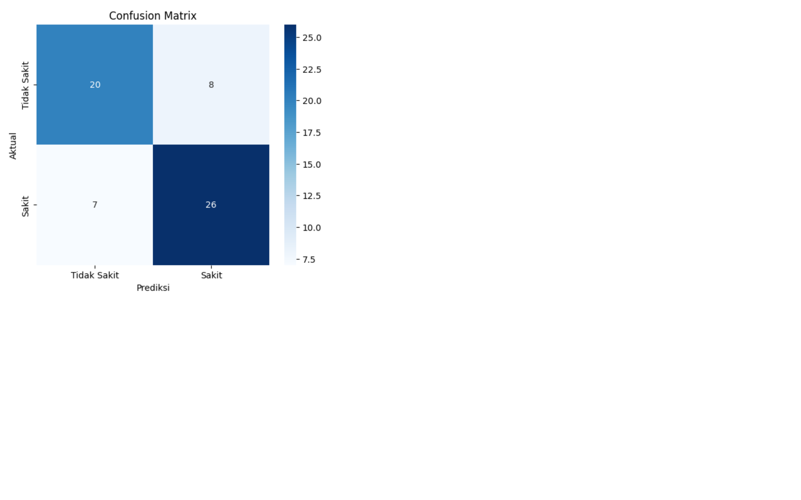
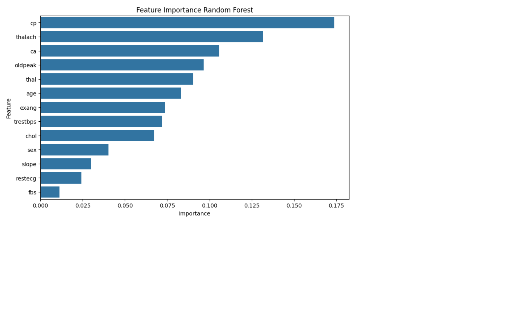
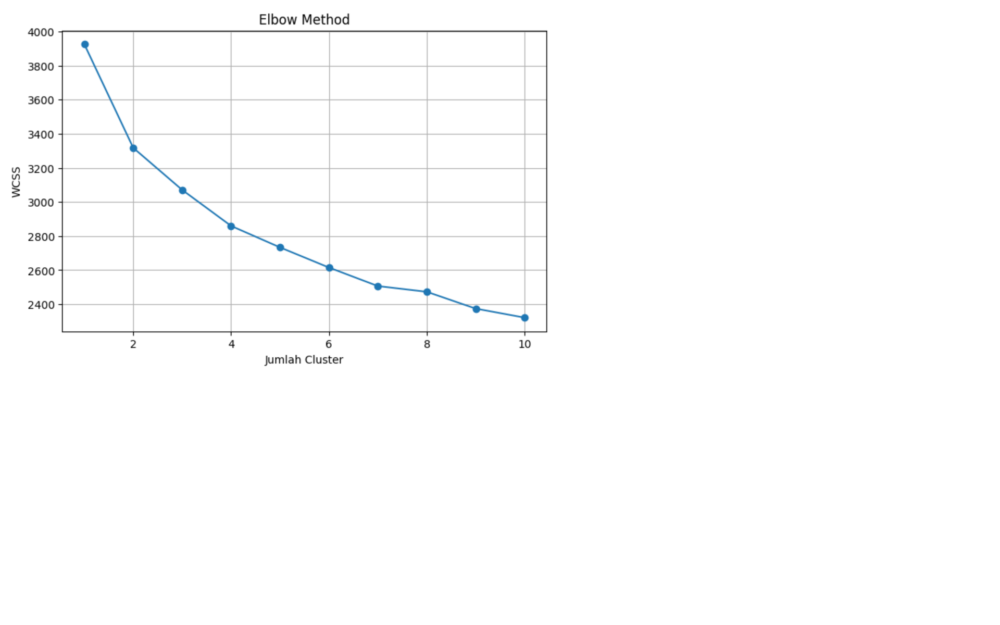
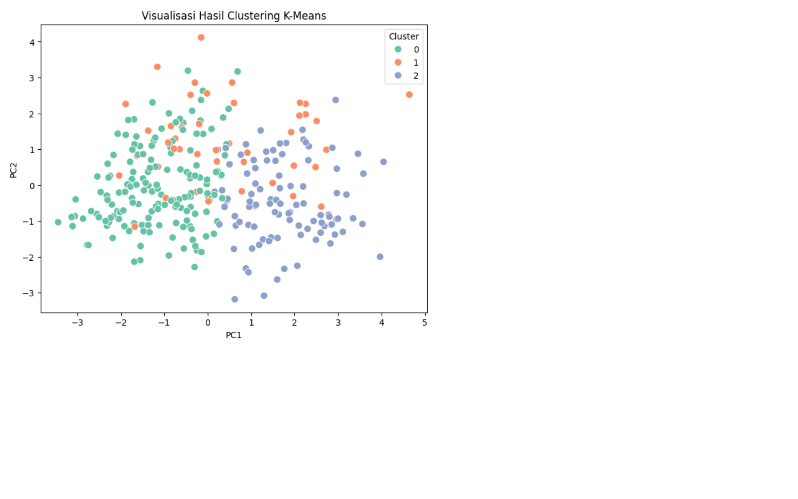
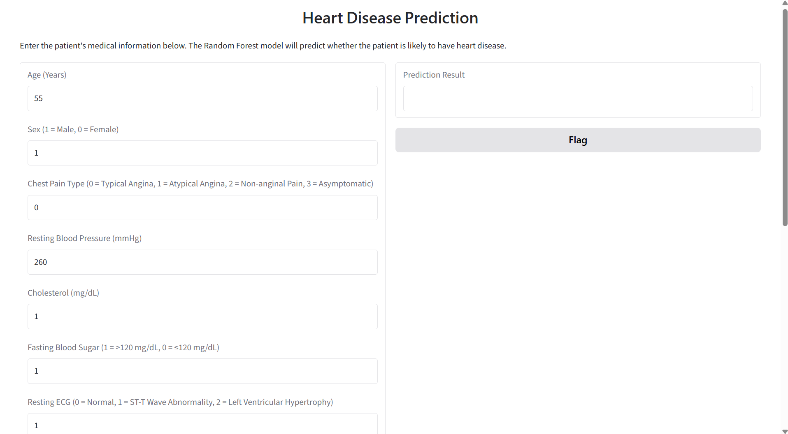
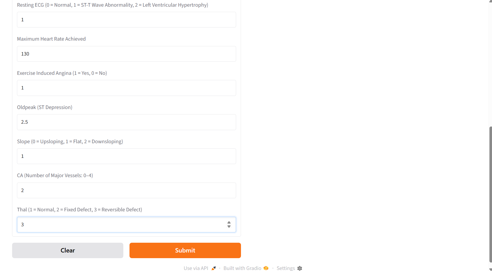
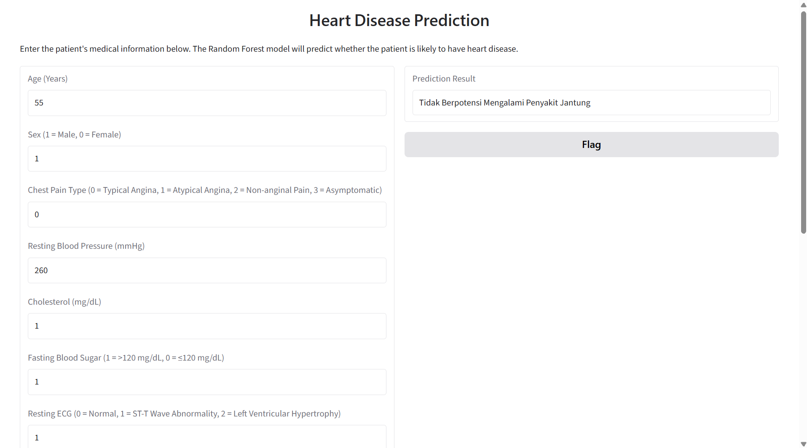

# 📊 Dokumentasi Hasil

## 1. Confusion Matrix

Confusion Matrix digunakan untuk mengevaluasi performa model Random Forest dalam melakukan klasifikasi penyakit jantung.

---

## 2. Feature Importance

Visualisasi berikut menunjukkan tingkat pengaruh masing-masing fitur terhadap hasil prediksi penyakit jantung.

---

## 3. Elbow Method

Elbow Method digunakan untuk menentukan jumlah cluster terbaik pada algoritma K-Means.

---

## 4. Visualisasi Hasil Clustering

Visualisasi berikut merupakan hasil pengelompokan pasien menggunakan algoritma K-Means yang telah direduksi menjadi dua dimensi menggunakan PCA.

---

## 5. Tampilan Awal Aplikasi Gradio

Berikut merupakan tampilan awal aplikasi sebelum pengguna memasukkan data pasien.

---

## 6. Pengisian Data Pasien

Pengguna mengisi data kesehatan pasien melalui antarmuka Gradio sebelum melakukan prediksi.

---

## 7. Hasil Prediksi

Setelah seluruh data diisi, aplikasi akan menampilkan hasil prediksi apakah pasien berpotensi mengalami penyakit jantung atau tidak.

